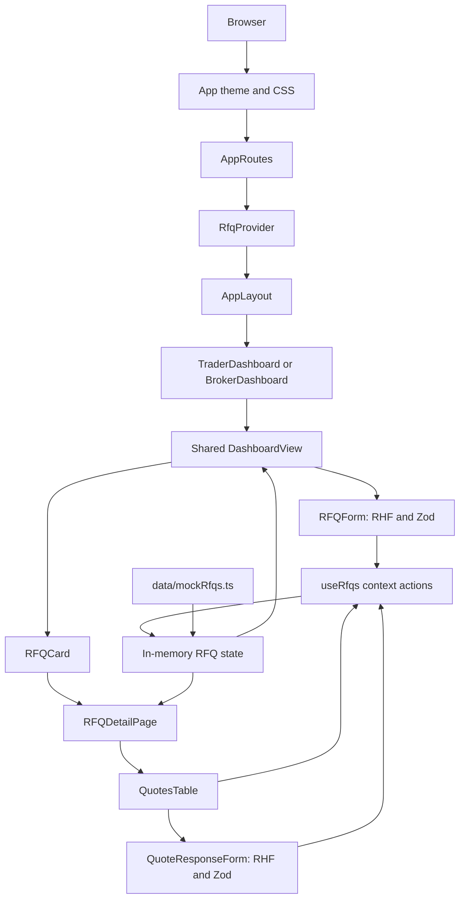

# Fieldnote Commodity Desk

A React and TypeScript demo for commodity RFQ procurement with Trader and Broker workspaces.

## Run locally

```sh
npm install
npm start
```

The development server opens at `http://localhost:3000`. Run `npm test -- --watchAll=false` for workflow tests and `npm run build` for a production build.

## Workspaces

- Trader view scopes the feed to North Harbor Trading and supports RFQ creation and quote decisions.
- Broker view covers assigned trader accounts, supports account filtering, and allows creating or submitting requests on a trader's behalf.
- RFQ detail views show terms, a validity countdown, offers, and accept/counter/decline actions.
- The dashboard combines RFQ activity trends with a live status distribution chart.
- Create RFQ validates the delivery date range, future quote expiry, positive prices and quantities, and selected counterparties.

The role switcher is a demo control, not authentication. Data is held in browser memory and resets on reload. Production use requires authenticated users, server-side role enforcement, persistent storage, and authoritative quote/transaction handling.

## Architecture

### Runtime composition

`src/index.tsx` mounts the React application. `src/App.tsx` provides the global MUI theme and CSS reset, then renders `AppRoutes`. `src/routes/AppRoutes.tsx` creates the browser router, wraps route content in `RfqProvider`, and defines the Trader and Broker route trees.

| Route | Layout | Page |
| --- | --- | --- |
| `/` | Redirect | `/trader` |
| `/trader` | `AppLayout(role="trader")` | `TraderDashboard` |
| `/trader/rfq/:rfqId` | `AppLayout(role="trader")` | `RFQDetailPage(role="trader")` |
| `/broker` | `AppLayout(role="broker")` | `BrokerDashboard` |
| `/broker/rfq/:rfqId` | `AppLayout(role="broker")` | `RFQDetailPage(role="broker")` |

`AppLayout` owns navigation, role switching, and the profile dialog. `TraderDashboard` and `BrokerDashboard` are small route adapters over `DashboardView`; the shared view owns filters, metrics, charts, and RFQ creation. Broker account scope is selected in the dashboard and passed to the shared feed logic.

### Data and interaction flow



`useRfqs` is the state boundary. It seeds state from `data/mockRfqs.ts`, creates RFQs, submits drafts, records a response without replacing the supplier's original quote, and handles accept/decline lifecycle transitions. Pages and reusable components receive data and callbacks; UI components do not import or mutate mock data directly.

There is currently no API, database, session persistence, or server-side authorization layer. The role switcher and account filters are presentation/demo controls. For production, replace the in-memory provider with an API-backed repository and enforce user, trader-account, and quote permissions on the server.

## Source layout

```text
src/
  components/
    charts/       ProcurementChart, RfqStatusChart
    forms/        RFQForm, QuoteResponseForm
    rfq/          RFQCard, QuotesTable, RFQStatusChip, RFQSummaryMetrics, ValidityCountdown
    ProfileDialog.tsx  Profile and account details
  data/           Mock RFQs, accounts, counterparties, chart series
  hooks/          Shared RFQ state and lifecycle actions
  layouts/        Role-aware application shell
  pages/          Trader, Broker, shared dashboard, RFQ detail
  routes/         Trader and Broker route tree
  types/          RFQ, quote, status, role, and form types
```

## Stack

React, TypeScript, Material UI, Lucide, React Router, Recharts, React Hook Form, and Zod. IBM Plex Sans provides a consistent, high-legibility interface typeface.

## Design system

See [DESIGN_SYSTEM.md](DESIGN_SYSTEM.md) for shared color tokens, typography, controls, status semantics, responsive behavior, and accessibility guidance.